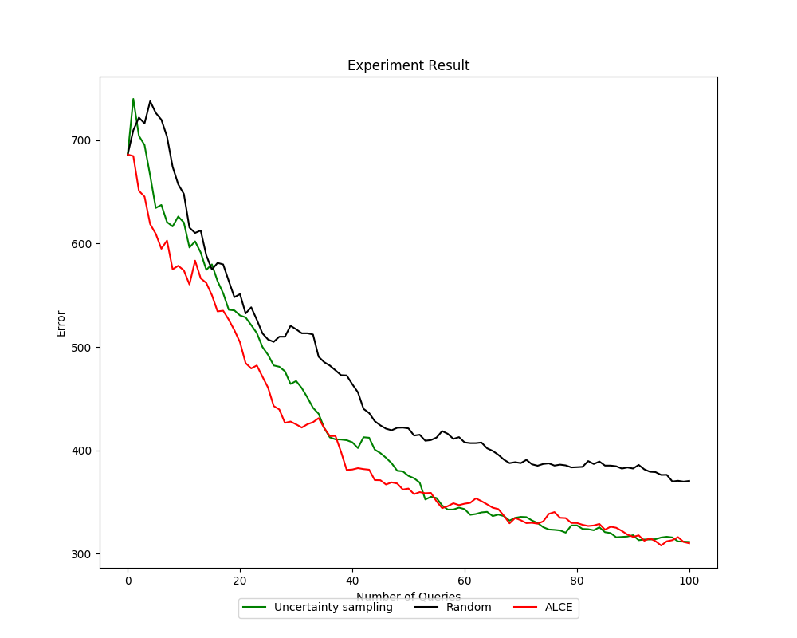

Cost Sensitive Active Learning
==============================

Most active learning algorithms are designed to deal with a specific
miss-classification error. Though in the real-world applications, the cost for
miss-classification varies. Cost-sensitive active learning algorithms allows the
user to pass in the cost matrix as a parameter and select the data points that
it thinks to perform the best on the given cost matrix.

Assume we have a total of K classes, **cost matrix** can be represented as a K*K
matrix. The i-th row, j-th column represents the cost of the ground truth being
i-th class and prediction as j-th class. The goal is to minimize the total cost.

*libact* provided the algorithm Active Learning with Cost-Embedding (ALCE)
(libact.query_strategies.multiclass.ActiveLearningWithCostEmbedding)
dedicated to solve this problem.

Example file: :file:`examples/alce_plot.py`

The multi-class dataset to use is the *vehicle* dataset from mldata retrieved by
sklearn (sklearn.datasets.fetch_mldata('vehicle')).
The cost matrix is generated randomly.

.. code-block:: python
   :linenos:

   cost_matrix = 2000. * np.random.rand(len(target), len(target))

The ``target`` variable is a list of different classes.
The value ``cost_matrix[i][j]`` represent the cost of i-th class in ``target``
being predicted as j-th class in ``target``.

In this example, we compared ALCE with Ucertainty Sampling and Random Sampling.
The main difference in declaring an ALCE object is the cost_matrix should be
passed in as a parameter (``ALCE(trn_ds3, cost_matrix, SVR())``).
The result is shown as follows.

