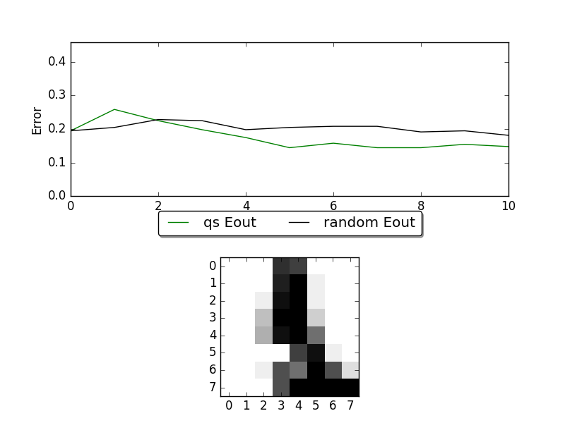

Interactive Digits Labeling
===========================

.. role:: python_code(code)
   :language: python

Example file: :file:`examples/label_digits.py`

This example simiulates the use case where you want to humane to assign label to
active learning algorithm selected samples. We uses the `digits dataset
<http://scikit-learn.org/stable/modules/generated/sklearn.datasets.load_digits.html>`_
provided by scikit-learn. Each time a sample is selected by active learning
algorithm, the sample (a written digit) will be shown on the screen. The
user will have to enter the corresponding digit to the command line to finish
the labeling process.

The useage is roughly the same as the :code:`plot.py` example.

.. literalinclude:: ../../examples/label_digits.py
   :language: python
   :lines: 86-91
   :linenos:

The difference is that the :code:`labeler` is replaced by
:python_code:`InteractiveLabeler`, which opens the digit image for human labeler
to see and receive the answer from command line.

Here are a snapshot of this example:

The figure on the top is the learning curve of ucertainty sampling and random
sampling.  X-axis is the number samples of queried, and Y-axis is the
corresponding error rate. The figure on the button is the sample that human
should assign label to.

Full source code:

.. literalinclude:: ../../examples/label_digits.py
   :language: python
   :linenos:
