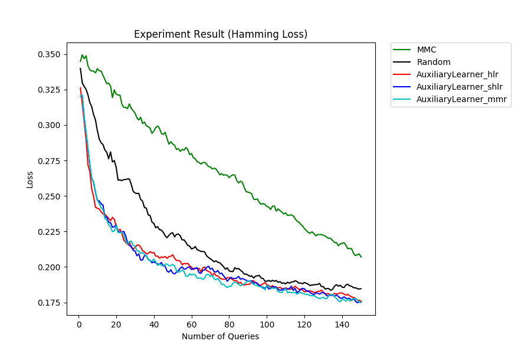
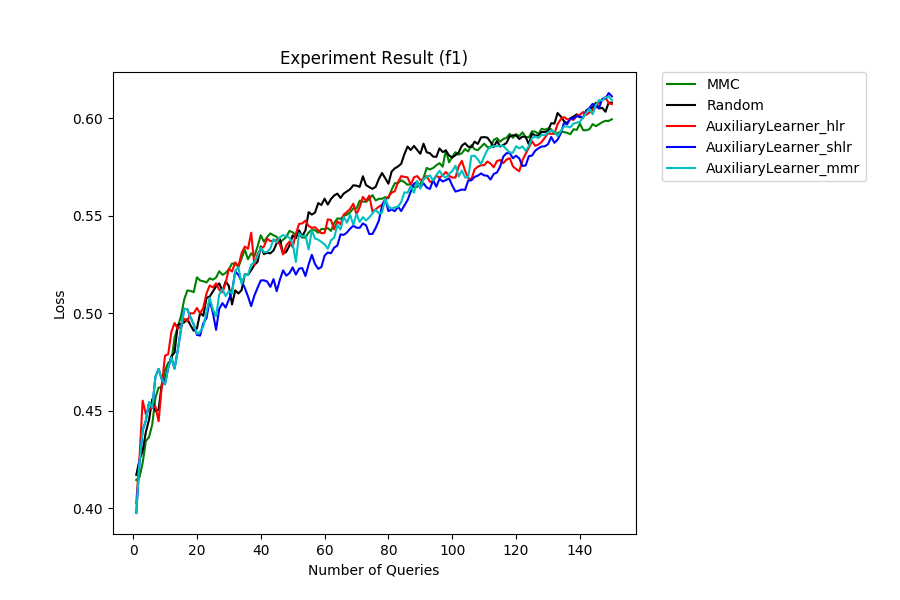

Multilabel Query Strategies
===========================

Example file: :file:`examples/multilabel_plot.py`

This example demonstrates the usage of `libact` in multilabel setting, which is
the same under binary-class setting.  This examples compares with the three
multilabel active learning algorithms (Binary Minimization (BinMin), Maximal
Loss Reduction with Maximal Confidence (MMC), Multilabel Active Learning With
Auxiliary Learner (MLALAL).  BinMin calculates the uncertainty of each label
independently while MMC and MLALAL computes the uncertainty through evaluating
the difference between predictions from two different multilabel classifiers.
MMC has these two multilabel classifiers and the formula of evaluating the
difference in prediction fixed.  The multilabel classifiers it uses is binary
relevance and stacked logistic regression.  MLALAL is a more generalized
version, we are able to freely assign multilabel classifiers and `libact`
provides three different options for evaluating the difference in prediction
(hamming loss reduction, soft hamming loss reduction and, maximum margin
reduction).

From the example we can see how these algorithms are assigned.

For BinMin, we only need a ContinuousModel for it to evaluate uncertainty.

.. code-block:: python
   :linenos:

   qs6 = BinaryMinimization(trn_ds6, LogisticRegression())

MMC on the other hand, it needs a base learner for its binary relevance.

.. code-block:: python
   :linenos:

   qs = MMC(trn_ds, br_base=LogisticRegression())

MLALAL need to assign two multilabel models.  One serves as `major_learner`, and
another serves as `auxiliary_learner`.  The `major_leaner` should be the model
to be use for final prediction and gives a binary output on each label.
`auxiliary_learner` is only use to estimate the confident on each label, it
should give a real value output (supports `pred_real` method).

.. code-block:: python
   :linenos:

   qs3 = MultilabelWithAuxiliaryLearner(
       trn_ds3,
       BinaryRelevance(LogisticRegression()),
       BinaryRelevance(SVM()),
       criterion='hlr')

The results of this example on a artificial generated from `sklearn`  is shown
as follows:

