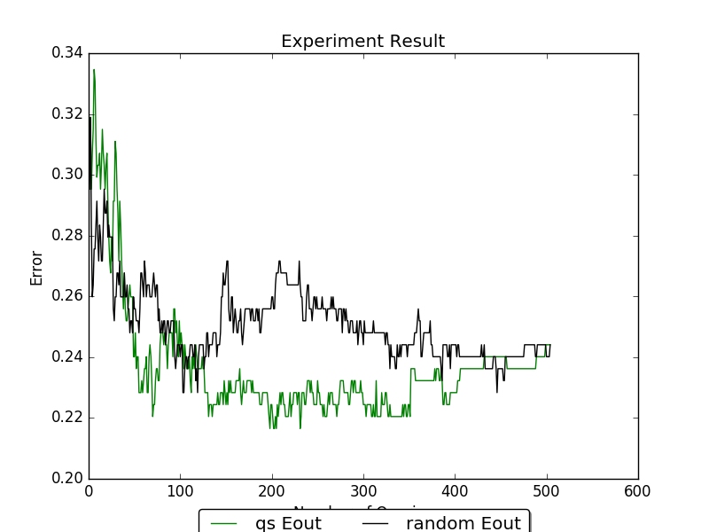

Comparing Different Query Strategies
====================================

.. role:: python_code(code)
   :language: python

Example file: :file:`examples/plot.py`

This example shows the basic way to compare two active learning algorithm.  The
script is located in :code:`/examples/plot.py`. Before running the script, you
need to download sample dataset by running :code:`/examples/get_dataset.py` and
choose the one you want in variable :python_code:`dataset_filepath`.

.. literalinclude:: ../../examples/plot.py
   :language: python
   :lines: 56
   :linenos:

First, the data are splitted into training and testing set:

.. literalinclude:: ../../examples/plot.py
   :language: python
   :pyobject: split_train_test
   :linenos:

The main part that uses `libact` is in the :python_code:`run` function:

.. literalinclude:: ../../examples/plot.py
   :language: python
   :pyobject: run
   :linenos:

In the :python_code:`for` loop on line :code:`25`, it iterates through each
query in active learning process. :python_code:`qs.make_query` returns the
index of the sample that the active learning algorithm wants to query.
:python_code:`lbr` acts as the oracle and :python_code:`lbr.label` returns the
label of the given sample answered by oracle. :python_code:`ds.update` updates
the unlabeled sample with queried label.

A common way of evaluating the performance of active learning algorithm is to
plot the learning curve. Where the X-axis is the number samples of queried, and
the Y-axis is the corresponding error rate.  List :python_code:`E_in`,
:python_code:`E_out` collects the in-sample and out-sample error rate after each
query. These information will be used to plot the learning curve. Learning curve
are plotted by the following code:

.. literalinclude:: ../../examples/plot.py
   :language: python
   :lines: 82-92
   :linenos:

The following figure are the result of using the `diabetes` dataset with
:python_code:`train_test_split` and :python_code:`LogisticRegression`'s
random_state set as 0, and :python_code:`random.seed(0)`. The E_out line are
removed for simplicity.

We can see from the example that uncertainty sample is able to reach lower error
rate faster than random sampling.

Full source code:

.. literalinclude:: ../../examples/plot.py
   :language: python
   :linenos:
